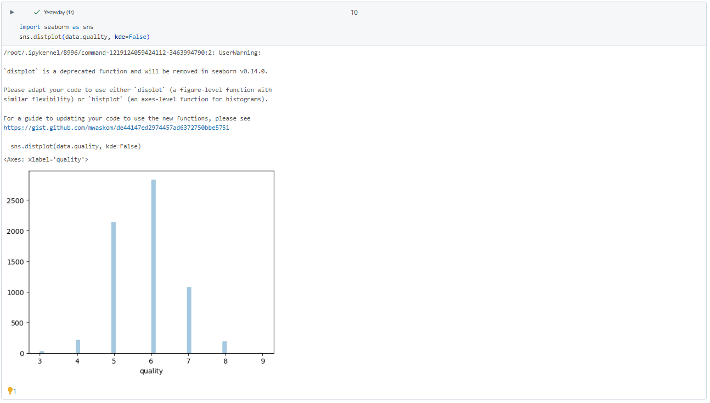
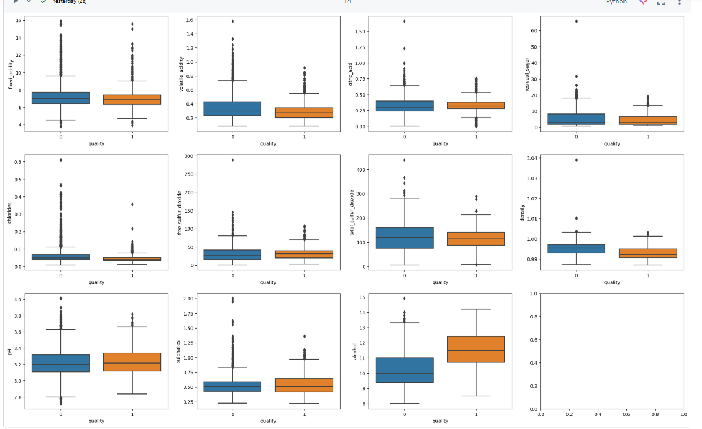
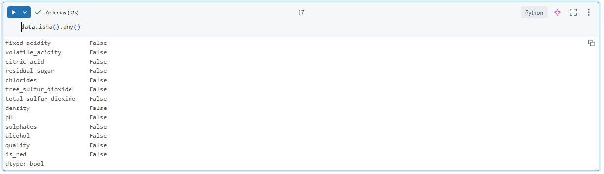
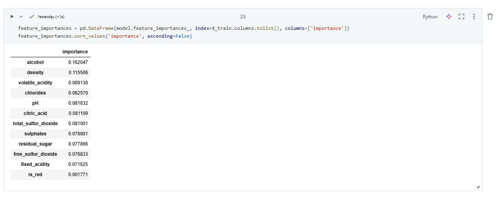
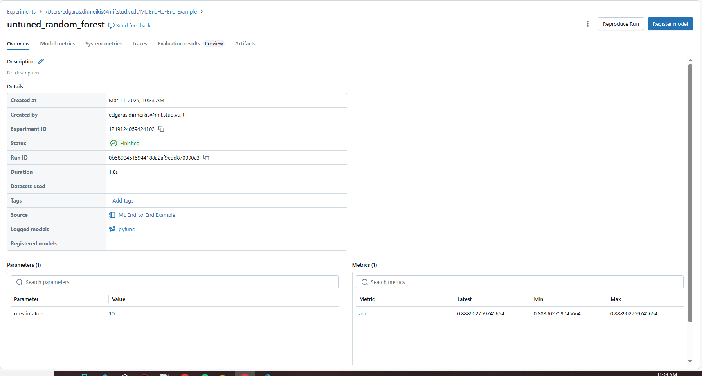
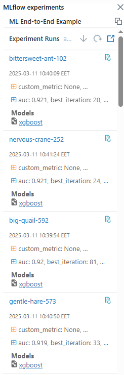
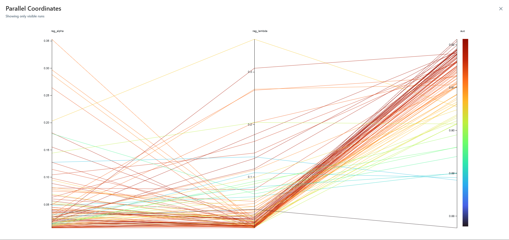
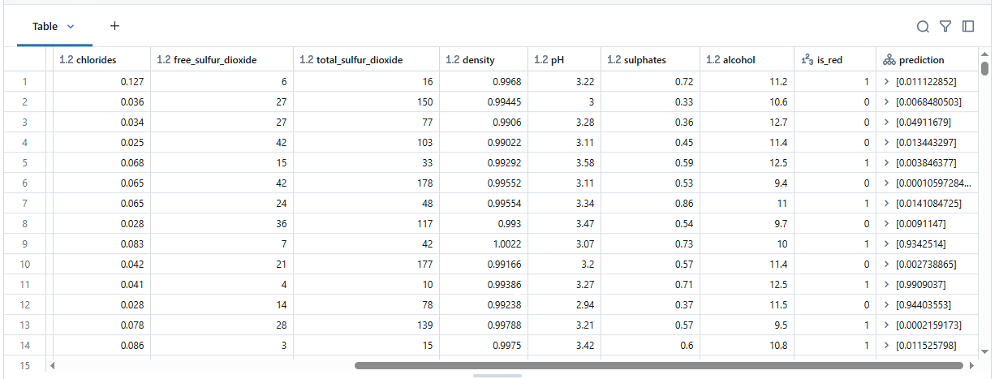

# ML End-to-End Example

## Overview
This repository contains a Databricks Notebook that demonstrates an end-to-end machine learning workflow on tabular data. The tutorial covers data import, visualization, preprocessing, model training, batch inference.

## Steps Covered

### 1. Import Data
The dataset is loaded from local storage into Databricks File System (DBFS):
```python
import pandas as pd

white_wine = pd.read_csv("/dbfs/FileStore/shared_uploads/winequality_white.csv", sep=';')
red_wine = pd.read_csv("/dbfs/FileStore/shared_uploads/winequality_red.csv", sep=';')  
```
After loading, the datasets are merged into a single dataset with an additional feature indicating the wine type:
```python
red_wine['is_red'] = 1
white_wine['is_red'] = 0

data = pd.concat([red_wine, white_wine], axis=0)
data.rename(columns=lambda x: x.replace(' ', '_'), inplace=True)
```

### 2. Data Visualization
Exploring the dataset using Seaborn and Matplotlib:
```python
import seaborn as sns
sns.histplot(data.quality, kde=False)
```
This shows the quality of the data being used


```python
import matplotlib.pyplot as plt

dims = (3, 4)
f, axes = plt.subplots(dims[0], dims[1], figsize=(25, 15))
axis_i, axis_j = 0, 0
for col in data.columns:
  if col in ['is_red', 'quality']:
    continue
  sns.boxplot(x=data["quality"], y=data[col], ax=axes[axis_i, axis_j])
  axis_j += 1
  if axis_j == dims[1]:
    axis_i += 1
    axis_j = 0
```
Lower dispersion means the data is better, alcohol and density have the lowest dispersion, which is good for ML.



### 3. Preprocessing
There are no missing data, so it means that our dataset is good to go


### 4. Model Training

#### Baseline Model (Random Forest Classifier)
Using scikit-learn and MLflow for tracking:
```python
import mlflow
import mlflow.sklearn
from sklearn.ensemble import RandomForestClassifier
from sklearn.metrics import roc_auc_score

with mlflow.start_run(run_name='untuned_random_forest'):
  model = RandomForestClassifier(n_estimators=10, random_state=123)
  model.fit(X_train, y_train)
  predictions_test = model.predict_proba(X_test)[:,1]
  auc_score = roc_auc_score(y_test, predictions_test)
  mlflow.log_metric('auc', auc_score)
  mlflow.sklearn.log_model(model, "random_forest_model")
```
We can see that the two most important criteria for the wine quality are alcohol and density



First models auc score was 0.88, which is not bad


#### Registering and Deploying Model
Registering and transitioning the model to production:
```python
from mlflow.tracking import MlflowClient
client = MlflowClient()
model_version = mlflow.register_model(f"runs:/{run_id}/random_forest_model", "wine_quality")
client.transition_model_version_stage("wine_quality", model_version.version, "Production")
```

#### Hyperparameter Tuning with XGBoost
Using Hyperopt for parameter optimization:
```python
from hyperopt import fmin, tpe, hp, SparkTrials
import xgboost as xgb

def train_model(params):
  mlflow.xgboost.autolog()
  with mlflow.start_run(nested=True):
    booster = xgb.train(params=params, dtrain=X_train, num_boost_round=1000,
                        evals=[(X_test, "test")], early_stopping_rounds=50)
    return {'loss': -roc_auc_score(y_test, booster.predict(X_test)), 'status': 'ok'}

spark_trials = SparkTrials(parallelism=10)
with mlflow.start_run(run_name='xgboost_models'):
  best_params = fmin(fn=train_model, space={}, algo=tpe.suggest, max_evals=96, trials=spark_trials)
```
Here we can see the improvement in the auc score, it jumped to 0.921, that's why this model is better.



This shows us that generally the lower score for reg_alpha and reg_lambda accounts for better auc score



### 5. Batch Inference
Loading the model as a Spark UDF and applying it to a Delta table:
```python
import mlflow.pyfunc
apply_model_udf = mlflow.pyfunc.spark_udf(spark, "models:/wine_quality/production")
from pyspark.sql.functions import struct
udf_inputs = struct(*X_train.columns.tolist())
new_data = new_data.withColumn("prediction", apply_model_udf(udf_inputs))
```
You can see that in made predictions successfully

